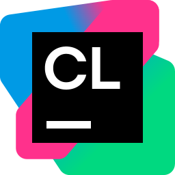

  
  <h1>Hi, my name is Gold Lego!</h1>
  <h3>From web layouts to game logic, a journey in code.</h3>

---

  
  
  

---

### About Me

I first discovered programming through a passion for **video games**, a medium that captured my imagination. As a creative person who often felt limited by a lack of resources, the realization that I could build entire virtual worlds from scratch with just a computer was incredibly liberating. This discovery set me on a path of self-learning and exploration, where every line of code became a tool to bring my ideas to life.

My journey has been a focused pursuit of knowledge, moving from fundamental concepts to building complex systems. I started with languages like **C++** and **Java**, which taught me the importance of structure and object-oriented principles. This foundation has shaped my philosophy: I am a firm believer in **clean, optimized code** and the **DRY (Don't Repeat Yourself)** principle. I strive to write elegant and efficient programs that are both powerful and easy to maintain.

One of my proudest projects is a **custom IDE I built in Python**. This tool allows a developer to write HTML, CSS, and JavaScript simultaneously, streamlining the web development workflow. It's a testament to my ability to not only use languages but also to build the tools that make coding more efficient.

Looking forward, I'm expanding my skill set to include **TensorFlow** to explore the world of AI. This next step is driven by a desire to apply my problem-solving skills to new and challenging domains. Whether it's building engaging web experiences or crafting intricate game mechanics, I am dedicated to continuous learning and using code to turn ambitious ideas into reality.

---

### My Skills & Tools

  
  
  
  
  
  
  
  
  
  
  
  
  
  
  
  

---

### Connect with Me

* <a href="https://www.linkedin.com/in/adithya-oscar-5848a1323/" target="_blank">LinkedIn</a>
* <a href="mailto:goldlegomain@gmail.com">Email</a>
* 

---

### Fun Facts

* I'm currently based in Bangalore, India.
* I'm currently learning **TensorFlow, Keras**, and **Anime.js**.
* I'm looking to collaborate on **game development, app development, full-stack projects**, and small functional apps.
* I Like dinosaurs :D, I also Like Cars that run on fossil fuels >:D
